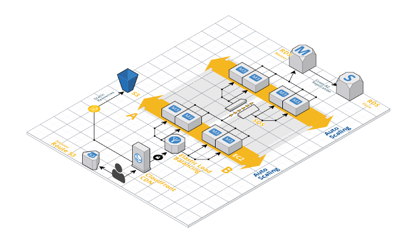

# Tinjauan Pustaka

Bab ini menyintesis teori dan penelitian terdahulu untuk mempertajam
kesenjangan serta menunjukkan posisi penelitian. Hindari menyusun literatur
sebagai rangkaian ringkasan yang tidak saling dibandingkan. Contoh sitasi dapat
ditulis sebagai [@knuth2001art].

## Landasan Teoretis

Uraikan teori, konsep, model, kerangka kerja, dan definisi istilah kunci yang
langsung diperlukan untuk memahami penelitian.

{#fig-infrastruktur width=80%}

Pada @fig-infrastruktur ditunjukkan contoh penggunaan cross-reference Quarto.

## Penelitian Terdahulu

Kelompokkan dan bandingkan penelitian penting berdasarkan masalah, metode,
data, dan hasilnya. Tabel sintesis dapat membantu memperlihatkan pola.

| Penelitian | Masalah/tujuan | Pendekatan | Temuan utama | Keterbatasan |
|---|---|---|---|---|
| Penelitian A | Tuliskan fokus | Tuliskan metode | Tuliskan hasil | Tuliskan batasan |
| Penelitian B | Tuliskan fokus | Tuliskan metode | Tuliskan hasil | Tuliskan batasan |

: Contoh matriks sintesis penelitian terdahulu {#tbl-studi-terkait}

## Sintesis Temuan Literatur

Jelaskan apa yang sudah diketahui, pendekatan yang telah berhasil, perbedaan
hasil yang penting, dan keterbatasan yang berulang dalam literatur.

## Kesenjangan Penelitian

Rumuskan masalah yang belum terselesaikan berdasarkan sintesis literatur, bukan
hanya berdasarkan ketiadaan penelitian yang identik.

## Posisi dan Kebaruan Penelitian

Jelaskan perbedaan penelitian ini dari penelitian terdahulu serta kontribusi
atau kebaruan yang diharapkan.
